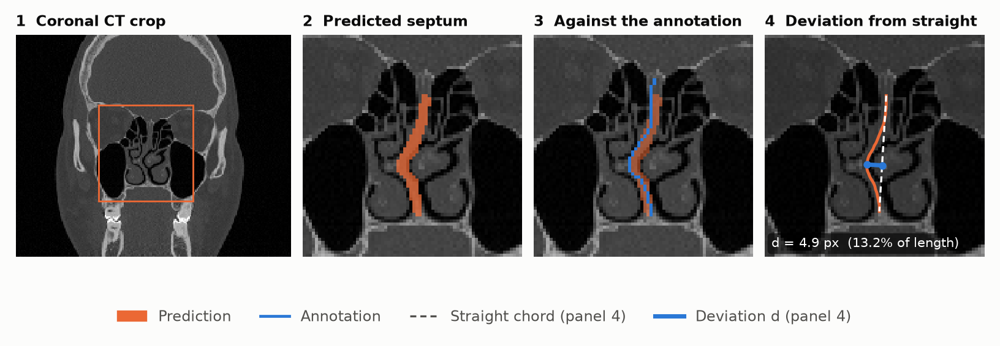
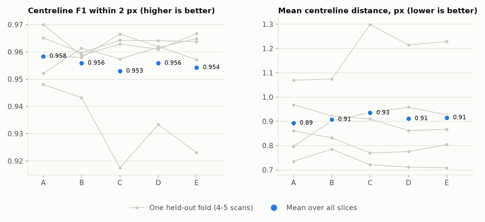
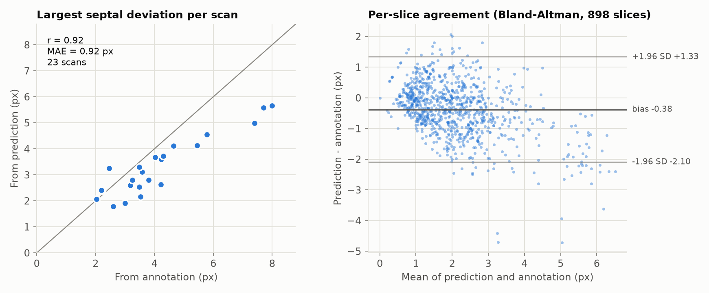
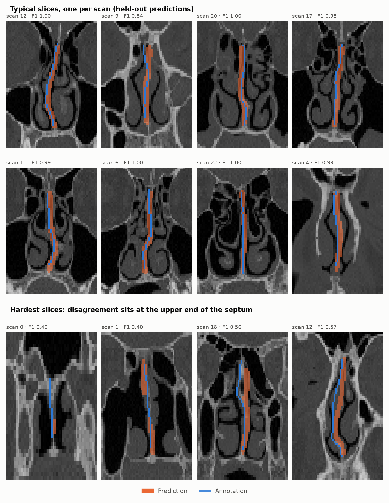

# Nasal septum segmentation and deviation measurement from CT

Segments the nasal septum on coronal CT slices and measures how far it bends away from a
straight septum, as input to pre- and post-septoplasty airflow studies (Biofluids Lab,
IIT(ISM) Dhanbad).

<picture>
  <source media="(prefers-color-scheme: dark)" srcset="docs/figures/overview-dark.png">
  
</picture>

## Highlights

- **899 hand-traced coronal slices from 23 CT series**, evaluated with 5-fold cross-validation
  grouped by scan: every slice is predicted by a model that never saw its scan.
- **Centreline F1 0.956 within 2 px** (median slice 0.978), mean centreline distance
  **0.91 px**, HD95 **2.65 px**.
- **Septal deviation agrees with the manual trace**: per-scan maximum deviation r = **0.92**,
  per-slice mean absolute error **0.72 px**.
- **Found and fixed a label-processing bug** in the 2024 pipeline: thresholding the
  anti-aliased Label Studio strokes at >127 broke 71% of traces into dashes and emptied 80 masks.
- **~2 ms per slice** inference; about 10 min to train one fold on an RTX A4000.

## Data

- Coronal slices cropped around the nasal cavity at native resolution (132-183 x 193-257 px),
  each with the septum traced as a line in Label Studio.
- **Scan identity** is recovered from the crop geometry: each series was cropped once, so the
  crop size identifies it, and slices keep acquisition order (neighbouring slices differ by
  7.0 grey levels on average vs 19.3 for random slices of the same scan).
- **Targets.** Label Studio exports brush strokes as anti-aliased 1-px lines. The 2024 pipeline
  thresholded them at >127, which leaves only 29% of traces connected. Thresholding at >0
  keeps 98% as one continuous line. The target is the traced centreline (skeleton of
  mask > 0), dilated to a 3-px band for training.

<picture>
  <source media="(prefers-color-scheme: dark)" srcset="docs/figures/label_fix-dark.png">
  127 (dashed) and >0 (continuous), and the share of traces kept as one line" src="docs/figures/label_fix-light.png">
</picture>

### Data availability

The CT crops and annotations are not included in this repository. They can be shared for
research use on request; please open an issue or contact the author.

## Method

- 5-fold cross-validation **grouped by scan** (4-5 scans per fold); no series contributes
  slices to both training and test.
- Slices are zero-padded to 272 x 272 without resampling, so a 1-px structure is not blurred.
- Augmentation: horizontal flip, small affine (±10°, ±10% scale, ±5% shift), brightness/contrast.
- AdamW, 100 epochs, warm-up + cosine schedule, bfloat16 autocast. The last-epoch model is
  evaluated; no checkpoint is chosen on the test fold.

| | Model | Loss | Input |
|---|---|---|---|
| A | U-Net from scratch (the 2024 architecture) | BCE | slice |
| B | U-Net from scratch | BCE + Dice | slice |
| C | U-Net, ImageNet ResNet34 encoder | BCE + Dice | slice |
| D | U-Net, ImageNet ResNet34 encoder | BCE + Dice + clDice | slice |
| E | U-Net, ImageNet ResNet34 encoder | BCE + Dice + clDice | 2.5D (previous / current / next slice) |

### Metrics

A 1-px shift halves the overlap of a thin structure, so overlap alone misleads.

- **Centreline F1 @ 2 px**: share of the predicted centreline within 2 px of the trace
  (precision) and of the trace within 2 px of the prediction (recall).
- **clDice** (Shit et al., CVPR 2021), **mean and 95th-percentile centreline distance**, and
  **Dice on the 3-px band** for reference.
- **Septal deviation**: the centreline is reduced to one x per row and smoothed over 5 rows;
  deviation is the largest perpendicular distance from the chord joining its ends (px, and %
  of septum length). Agreement with the trace is reported per slice (MAE, Bland-Altman) and
  per scan (maximum over slices, Pearson r).

## Results

| | F1@2px | clDice | Dice (band) | Centreline dist (px) | HD95 (px) | Deviation MAE (px) | Scan deviation r | Fragmented | Train / fold | Inference |
|---|---|---|---|---|---|---|---|---|---|---|
| A | **0.958** ± 0.009 | 0.880 ± 0.038 | 0.728 | **0.89** ± 0.13 | 2.79 | 0.71 | 0.82 | 3.3% | 26 min | 5.2 ms |
| B | 0.956 ± 0.007 | **0.887** ± 0.023 | **0.732** | 0.91 ± 0.11 | 2.82 | **0.69** | 0.88 | 4.6% | 26 min | 6.9 ms |
| C | 0.953 ± 0.021 | 0.871 ± 0.051 | 0.719 | 0.93 ± 0.23 | 2.71 | **0.69** | 0.87 | 2.6% | **8 min** | 2.1 ms |
| D | 0.956 ± 0.013 | 0.881 ± 0.041 | 0.726 | 0.91 ± 0.20 | **2.65** | 0.72 | **0.92** | **1.4%** | 10 min | 2.0 ms |
| E | 0.954 ± 0.018 | 0.883 ± 0.031 | 0.728 | 0.91 ± 0.20 | 2.78 | 0.71 | 0.86 | 2.3% | **8 min** | **1.6 ms** |

Mean over all 899 out-of-fold slices ± standard deviation of the 5 fold means. "Fragmented" is
the share of slices whose raw prediction splits into more than one piece. Training times are
per fold on an RTX A4000 (A, B) and a mix of A4000 / A5000 (C-E), so they are indicative.

<picture>
  <source media="(prefers-color-scheme: dark)" srcset="docs/figures/ablation-dark.png">
  
</picture>

**What the ablation shows.**

- Once the targets are fixed, **accuracy is the same across all five settings**: F1 ranges
  0.953-0.958, well inside the fold-to-fold spread. Which scans are held out matters far more
  than the model; fold 3 is hardest for every setting.
- **clDice (D)** gives the most coherent predictions: fewest fragmented slices (1.4% vs 3.3%
  for A), lowest HD95, and the best scan-level deviation agreement (r 0.92 vs 0.82).
- The **pretrained ResNet34 encoder** reaches the same accuracy about 3x faster to train and
  2.5x faster at inference than the from-scratch U-Net.
- **2.5D context (E)** does not help at this slice spacing.

D is used for the figures below, for its coherence and deviation agreement, not for a higher F1.

### Septal deviation

<picture>
  <source media="(prefers-color-scheme: dark)" srcset="docs/figures/deviation-dark.png">
  
</picture>

- Per scan, the largest deviation measured on predictions tracks the manual trace
  (r = 0.92, MAE 0.92 px over 23 scans).
- Per slice, the bias is **-0.38 px** with 95% limits of agreement **-2.10 to +1.33 px**.
- The model **underestimates the largest deviations**: predicted centrelines are smoother than
  hand-drawn traces, so strongly bent septa read about 2 px straighter. Calibrating this, or
  measuring on a smoothed trace, is the next step before any clinical use.

### Examples

<picture>
  <source media="(prefers-color-scheme: dark)" srcset="docs/figures/examples-dark.png">
  
</picture>

Most disagreement sits at the upper end of the septum, near the skull base, where the trace
and the prediction follow different thin bony edges.

## Reproduce

```bash
python prepare_data.py                                  # data/final-v4 -> data/
python train.py --config configs/d_resnet34_cldice.yaml --fold 0
scripts/run_queue.sh <gpu> scripts/jobs_s0a.txt         # a resumable queue of (config, fold) jobs
python aggregate.py                                     # results/summary.md
python readme_figures.py --best d_resnet34_cldice       # docs/figures/*
```

Environment: Python 3.11, PyTorch 2.6 (CUDA 12.4), segmentation-models-pytorch 0.5,
scikit-image, SciPy, albumentations, matplotlib.

## Limitations

- 23 series; the number of distinct patients is not recorded in the crops (likely fewer than
  23), so folds are grouped by series, not verified by patient.
- No DICOM headers survive the crops, so distances are in pixels, not mm.
- One annotator; inter-observer variability is not measured, and the hardest slices suggest
  the upper septum is ambiguous to trace.
